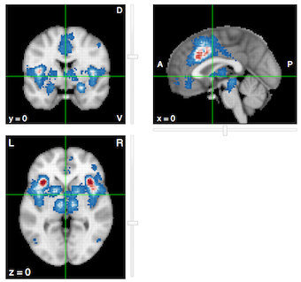

```{r "setup", include=FALSE}
knitr::opts_chunk$set(
	echo = TRUE,
	message = FALSE,
	comment = NA,
	cache = FALSE,
	warning = FALSE,
	fig.align='center'
)

# Libraries
library(tidyverse)
library(purrr)
library(oro.nifti)
library(neurobase)
library(mvmeta)
library(metafor)
library(ggridges)
library(cowplot)
library(NeuRRoStat)

# Custom function to extract tau from fit
ExtractTau <- function(Y, V){
  fit <- rma(yi = Y, vi = V, method = "DL")
  return(fit$tau2)
}

# Custom function to fit random effects model with DL estimator
#   and extra term for moderator (studies from same site)
# This function is used with purrr to apply over all voxels
fitDL_mod <- function(data){
  fit <- rma(yi = data$hedgeG, vi = data$varG, mods = ~ data$Group,
             method = 'DL', data = data)
  # Extracting tau2, I2, H2 and estimated weighted average
  coefD <- data.frame(tau2 = fit$tau2, I2 = fit$I2, H2 = fit$H2,
                      beta = fit$beta['intrcpt',])
  return(coefD)
}

# Custom function to fit random effects model with user 
#   specified method to estimate between-study variability.
# Note the extra term for moderator (studies from same site)
# This function is used with purrr to apply over all voxels
fit_mod <- function(data, type = c('DL','HE','HS','SJ','ML',
                                   'REML','EB','PM')){
  # Check type argument
  type <- match.arg(type)
  
  # Now fit the model
  fit <- rma(yi = data$hedgeG, vi = data$varG, mods = ~ data$Group,
             method = type, data = data)
  
  # Extracting I2, H2 and estimated weighted average
  coefD <- data.frame(tau2 = fit$tau2, I2 = fit$I2, H2 = fit$H2,
                      beta = fit$beta['intrcpt',], type = type)
  return(coefD)
}
```


```{r 'empty-grid', eval = FALSE, echo = FALSE, fig.width = 2, fig.height = 1.9, fig.align='center'}
plot.new()
```

&nbsp;
&nbsp;

```{r 'cover-image', echo = FALSE, fig.width = 6, fig.height = 6, fig.align='center', cache=TRUE}
# Read in object
dataG <- readRDS('1_Data/2_Processed/Images/cover_data.rds')
# Plot for cover of PDF
ggplot(dataG, aes(y = study, x = hedgeG)) +
  geom_density_ridges2(aes(fill = samplesize), scale = 2) +
  scale_y_discrete('Study', expand = c(0.01, 0)) +
  scale_x_continuous("Hedges' g", expand = c(0.01, 0)) +
  scale_fill_gradient2('Sample size', 
                       low = '#3288bd',
                       mid = '#ffffbf',
                       high = '#d53e4f') +
  guides(fill = 'none') +
  theme_ridges() +
  ggtitle('Artwork') +
  theme(text = element_text(size=10),
        axis.text = element_text(size=10))
```


\pagebreak

# Introduction

In this report, we estimate the amount of empirical between-study heterogeneity in a typical image-based fMRI meta-analysis. The goal is to obtain an idea of reasonable values of between-study heterogeneity.

At the moment, we have a database of 33 fMRI studies (N = 659) involving a general experience of pain versus no pain. 

# Database
The following [link ](https://github.com/NeuroStat/ESfMRI/tree/master/3_BSVar) contains general information about the database. In general, we are interested in the effect of experiencing pain versus a baseline or versus experiencing no pain. We explicitly use a general definition of _pain_ to obtain upper bounds on the observed between-study heterogeneity. Hence, we have studies that investigate the empathy of pain (i.e. seeing others having pain) or studies in which painful stimuli are given. There are multiple simuli available ranging from auditory, thermal to mechanical stimuli.

## Collection procedure
All studies are collected using the search term _pain_ in [NeuroVault](www.neurovault.org) at 11/01/2017. Results are manually checked and inputted in the database. 

Note that we do not follow guidelines (such as the [PRISMA](http://www.prisma-statement.org) guidelines) on how to collect/report studies for a meta-analysis/systematic review. We would need to put more efort in collecting images that are not available through NeuroVault. 

## Overview of database

The database contains the following studies:


| Study        | Sample size           | Type  |  Contrast |
| ---------------- |:-----------|:---------:|:--------------------------------------:|
|Braboszcz 2017 | 17            | T-map | Painful images >Painless images (Normal state) |
| Hebestreit 2017      | 23      |   T-map | Ammonia stimulation (trigeminal pain) > Air in both sessions (medication and placebo) |
| Tamm 2017 | 86      |  T-map | Pain > no pain [no covariates] |
| Karjalainen 2017 | 35      |  T-map | Main effect of vicarious pain |
| Atlas 2010 | 15      |  $\text{beta-map}^1$ | Thermal high vs low stimulation pain |
| Wager 2013 | 15      |  $\text{beta-map}^1$ | Somatic pain vs baseline |
| Kano 2017 | 15      |  $\text{beta-map}^1$  | Visceral pain vs baseline |
| Rubio 2015 | 15      |  $\text{beta-map}^1$  | Visceral pain vs baseline |
| Unpublished | 15      |  $\text{beta-map}^1$  | Mechanical high pressure pain vs baseline |
| Unpublished | 15      |  $\text{beta-map}^1$  | Mechanical medium pressure pain vs baseline |
| Patil 2017 | 46      |  T-map | Outcome of pain induced to others versus baseline |
| Maumet 2016 | Total = $334^2$      |  T-maps | Pain versus baseline |
| Chang 2015 | 28      |  T-maps | High pain versus low pain |

Some notes:

* We only include whole-brain analyses.
* 1) Data comes from Kragel et al, 2017. These maps contain the contrasts of the parameter estimates for each subject. Hence we first pool these subjects using OLS.
* 2) Study of Maumet et al., 2016 is about the *nidm* data structure. However, it contains **21** studies about pain. Note that these come from the same laboratory. In this report, we have added a variable to control for this.  

## ROI

In order to see whether between-study heterogeneity is different in brain areas known to involved in pain processing, we also create a Region of Interest (ROI). 
To do so, we create a binary mask using [NeuroSynth](www.neurosynth.org). After searching for the term _pain_, we obtain an automated meta-analysis of 420 studies. From here we use forward inference with a False Discovery Rate control at 0.01, the standard neurosynth procedure to create a mask. Forward inference is equal to: P(Activation|Term). 

Figure 1 shows the obtained regions of interests using this procedure. 



## Pre-processing

The main pre-processing step involves getting the statistical parametric maps (mostly _t_-images) to the same MNI 2mm space. This is simply done through resampling within the FSL GUI. This technique involves changing the dimensions of the voxels so that the overal image matches in dimension with the MNI standard.
We tried to do registration using _flirt_ or _fnirt_ to MNI space. However, we were unable to achieve reasonable registrations. 

# ROI Analysis

## Read in data

First we read in the meta-data about the database (name of files and sample sizes).
We also read in the ROI mask. 
```{r 'meta-data'}
# Number of studies
nstud <- 33
database <- read.csv2('database.csv', header = TRUE, stringsAsFactors = FALSE)
# Read in ROI mask 
ROI <- readNIfTI2('pain_pAgF_z_FDR_0.01_forward_mask')[,,]
# Dimension in 3D
DIM3D <- dim(ROI)
# Switch to array
ROI <- array(ROI, dim = prod(DIM3D))
# MNI standard (2mm)
MNI <- readNIfTI2('MNI152_T1_2mm_brain')[,,]
# MNI mask
MNImask <- readNIfTI2('MNI152_T1_2mm_brain_mask')[,,]
```

Now we load in the preprocessed data!

```{r 'read-data', cache = TRUE, cache.rebuild=FALSE}
# Read in the R object with all the studies
allStud <- readRDS(file = paste(getwd(), '/1_Data/2_Processed/allStud.rds', sep = ''))

# Distribution of all t-values
distrAllT <- data.frame(allStud) %>% as.tibble()
  names(distrAllT) <- paste('S', 1:nstud, sep = '')
distrAllT <- gather(distrAllT, key = 'study', value = 'Tvalue')
# Now only for masked values
distrAllT <- data.frame(distrAllT, ROImask = rep(ROI, nstud)) %>% as.tibble()
maskedVox <- filter(distrAllT, ROImask == 1)
# Create factor of study
maskedVox$study <- factor(maskedVox$study, levels = paste('S', 1:nstud, sep = ''))
```


## Distributions of t-values

Before focussing on distributions within ROI, let us look at the distribution of the t-values over all voxels in each study.

```{r 'distr-t-all', fig.align='center', fig.width=6, fig.height=6, cache = TRUE, cache.rebuild=FALSE}
# Raw ridge plot
ggplot(distrAllT, aes(y = study, x = Tvalue)) +
  geom_density_ridges2()
```

Now we plot the distributions of the t-values within the ROI. See caption of note on subdivission.

```{r 'distr-t-ROI', fig.show='hold', fig.height=8}
# Add variable for Maumet and other studies
IDvar <- c(rep('Other',11), rep('Maumet', 21), 'Other')
maskedVox$IDvar <- factor(rep(IDvar, each = sum(ROI)))
# Violin plot
ggplot(maskedVox, aes(x = study, y = Tvalue)) +
  geom_violin(aes(fill = IDvar)) +
  scale_y_continuous('T-value') +
  scale_x_discrete('Study') +
  scale_fill_brewer('ID study*', type = 'qual', palette = 2) +
  ggtitle("T-values from voxels in ROI") + 
  theme(legend.position = 'top') +
  labs(caption = "*Studies from Maumet are from same site.")
# Ridge plot
ggplot(maskedVox, aes(y = study, x = Tvalue)) +
  geom_density_ridges2(aes(fill = IDvar)) +
  scale_y_discrete('Study', expand = c(0.01, 0)) +
  scale_x_continuous('T-value', expand = c(0.01, 0)) +
  scale_fill_brewer('ID study*', type = 'qual', palette = 3) +
  ggtitle("T-values from voxels in ROI") +
  labs(caption = "*Studies from Maumet are from same site.") +
  theme_ridges() +
  theme(legend.position = 'top')
```


## Distributions of effect sizes

First we transform the reported t-value for each voxel to Hedges' _g_.

This is done through:
\begin{align}
g = \frac{t}{\sqrt{N}} \times h,
\end{align}
with $N$ the study sample size and *h* defined as:
\begin{align}
h = \dfrac{\Gamma\left(\dfrac{N - 1}{2}\right)}{\sqrt{\dfrac{(N - 1)}{2}} \Gamma \left( \dfrac{N-2}{2} \right)}.
\end{align}

We also calculate the within-study variance through:
\begin{align} \label{varHedge}
\text{Var}(g_e) &= \text{Var}(d) \times h^2 \\ \label{varG}
& = \left[\frac{(N - 1)(1 + N\delta^2)}{N(N - 3)} - \frac{\delta^2}{h^2}\right] \times h^2.
\end{align}

```{r 'transformation-t-to-g'}
dataG <- database %>% as.tibble() %>%
  mutate(study = factor(paste('S', 1:nstud, sep = ''),
                        levels = paste('S', 1:nstud, sep = ''))) %>%
  select(-img) %>% 
  # Join the voxels with the study IDs
  right_join(., maskedVox, by = 'study') %>%
  # Arrange by sample size
  arrange(samplesize) %>% 
  # Now transform to hedges' g and calculate variance
  mutate(hedgeG = NeuRRoStat::hedgeG(t = Tvalue, N = samplesize, type = 'exact'),
         varG = NeuRRoStat::varHedgeT(g = hedgeG, N = samplesize))
```

Now we plot the distributions of _g_ within the ROI, according to the sample size. 


```{r 'plot-g', fig.height=8, fig.width=8}
OrderFactorSS <- database %>% as.tibble() %>%
  mutate(study = factor(paste('S', 1:nstud, sep = ''),
            levels = paste('S', 1:nstud, sep = ''))) %>%
            select(-img) %>% arrange(samplesize)
dataG$study <- factor(dataG$study, levels = rev(OrderFactorSS$study))
ggplot(dataG, aes(y = study, x = hedgeG)) +
  geom_density_ridges2(aes(fill = samplesize), scale = 2) +
  scale_y_discrete('Study', expand = c(0.01, 0)) +
  scale_x_continuous("Hedges' g", expand = c(0.01, 0)) +
  scale_fill_gradient2('Sample size', 
                       low = '#3288bd',
                       mid = '#ffffbf',
                       high = '#d53e4f') +
  ggtitle("Hedges' g from voxels within ROI", 
    subtitle = 'Sorted according to study sample size (bottom to top: high N to low)') +
  theme_ridges()
```

Before we continue, note that smaller studies tend to have more positive distributions. In fact, this could indicate that we have publication bias in our dataset. However, the smallest 6 studies are actually obtained by fitting an OLS model to 15 randomly chosen subjects from their corresponding study dataset. Hence these studies are not an actual representation of the published work. 
Aside from these 6, the smaller studies do tend to show positive effect sizes. Ass do some larger studies though. 


## Meta-analysis

Now let us estimate the weighted averages using a random-effects model with the method of moments estimator for between-study heterogeneity. We will extract the weighted average (denoted as $\beta$) and the method of moments estimate for $\tau^2$, the between-study variability. Note that the latter is a standardized measure and hence operates on the same scale as Hedges' _g_. 
We also extract a measure for heterogeneity $I^2$ defined as:
$$
I^2 = \frac{Q - df}{Q} \times 100\%.
$$
Here, $Q$ is the amount of obseved dispersion between studies. Since this quantity is measured on a standardized scale, its expected value equals $df$, the degrees of freedom. Therefore, $I^2$ is the ratio between excess dispersion over total (observed) dispersion. It is a descriptive statistic of the amount of study heterogeneity in relation to the total variability. Note though that we assume homogeneous within-study variability for the interpretation of $I^2$. This is probably not the case! 
We also extract $H^2$. This is defined as:
$$
H^2 = \frac{Q}{k - 1}.
$$

Moreover, we add a moderator variable to control for acquisition site. Studies from the Maumet et al. database are acquired in the same laboratory. Hence we add a variable to code the 33 studies (_Maumet_ versus _Other_). This corresponds to a categorical dummy variable with _Maumet_ being the reference level. 

```{r 'MA-calculation', cache=TRUE}
# First have vector with study ID if comming from Maumet database
IDmaumet <- database %>% mutate(study = paste('S', 1:nstud, sep = '')) %>%
  mutate(CheckMaumet = ifelse(str_detect(img, 'Maumet'),'Maumet','Other')) %>%
  filter(CheckMaumet == 'Maumet') %>%
  select(study) %>% unlist(.)
names(IDmaumet) <- 1:length(IDmaumet)

# Now add voxel ID to dataframe and create a factor for the moderator variable.
#   This is to control for the fact that studies from Maumet et al. are from same site.
voxID <- dataG %>% mutate(voxel = rep(1:sum(ROI), nstud)) %>%
          mutate(Group = factor(ifelse(study %in% IDmaumet,
                               'Maumet', 'Other')))

# Although purrr is a bit slower, it is possible to conveniently 
#     extract multiple coefficients.
# To do so, we use our custom function fit_mod. This takes data from each voxel,
#   fits the model and extracts tau2, I2, H2 and a beta estimate (which is the weighted average).
# It does not extract the coefficient related to the moderator.
estTau <- voxID %>% split(.$voxel) %>% 
          map_df(~ fit_mod(data=.x, type = 'DL')) %>%
  as_tibble()
```

Let us plot the distributions over all voxels in the ROI of these 4 parameters. 

```{r 'distributions-4-parameters', fig.height=5, fig.width=5}
estTau %>% select(-type) %>%
  gather(key = 'Parameter', value = 'Value') %>%
  ggplot(., aes(x = Parameter, y = Value)) +
  geom_violin(aes(fill = Parameter), alpha = 0.5) +
  scale_fill_brewer('', type = 'qual', palette = 5) +
  facet_wrap(~ Parameter, scales = 'free', ncol = 1) +
  coord_flip() +
  scale_x_discrete('Parameter', labels = c('beta' = 'b*',
        'H2'   = expression(H^2),
        'I2'   = expression(I^2),
        'tau2'   = expression(tau[DL]^2))) +
  guides(fill = FALSE)  + 
  ggtitle('Observed distributions of various parameters inside ROI') +
  theme_bw() +
  theme(strip.background = element_blank(),
    strip.text.x = element_blank())
```

Overal, we observe mostly positive effect sizes within the ROI. For most voxels within the ROI, we estimate a modest amount of between-study heterogeneity ($\tau^2$). However, the maximum observed estimate for $\tau^2$ equals ```r max(estTau$tau2)```. This seems not trivial considering we only observe a maximum effect size of ```r max(estTau$beta)```.
Recall that we could roughly state that 95% of the true effects will fall in the range of:
$$
\hat\beta \pm 1.96 \hat\tau
$$
For instance, consider the voxel with the highest value for $\hat\tau$:
```{r 'highest-tau'}
filter(estTau, tau2 == max(tau2))
```
We then get 95% of the true effects for this voxel within the interval:
[```r filter(estTau, tau2 == max(tau2)) %>% select(beta) - 1.96 * sqrt(max(estTau$tau2))```;```r filter(estTau, tau2 == max(tau2)) %>% select(beta) + 1.96 * sqrt(max(estTau$tau2))```].

To see which values for the estimated effect sizes are associated with $\tau^2 > 0.10$, we look at the following two figures:

```{r 'tau2-with-es', fig.width = 8}
estTau %>% select(-type) %>%
  filter(tau2 >= 0.10) %>% select(tau2, beta) %>%
  gather(key = 'Parameter', value = 'Value') %>%
  ggplot(., aes(x = Parameter, y = Value)) +
  geom_violin(aes(fill = Parameter), alpha = 0.6) +
  scale_fill_brewer('', type = 'qual', palette = 6) +
  facet_wrap(~ Parameter, scales = 'free', ncol = 1) +
  coord_flip() +
  scale_x_discrete('Parameter', labels = c('beta' = expression(beta),
        'tau2'   = expression(tau^2))) +
  guides(fill = FALSE)  +
  ggtitle(expression(Observed ~ distributions ~ of ~ weighted ~ average ~ when ~ tau^2 >= 0.10)) +
  theme_bw() +
  theme(strip.background = element_blank(),
    strip.text.x = element_blank())
```

```{r 'hair-plot-beta-to-tau2', eval = FALSE, echo = FALSE}
lineData <- estTau %>% 
  select(-type) %>%
  filter(tau2 >= 0) %>%
  select(tau2, beta) %>%
  mutate(x = 'beta', xend = 'tau2')

estTau %>% 
  select(-type) %>%
  filter(tau2 >= 0) %>% select(tau2, beta) %>%
  gather(key = 'Parameter', value = 'Value') %>%
  ggplot(aes(x = Parameter, y = Value)) + 
  geom_point(aes(colour = Value), size = 0.5) + 
  geom_segment(data = lineData, 
               aes(x = x, xend = xend,
               y = beta, yend = tau2,
               colour = beta),
               size = 0.05,
               alpha = 0.8) +
  scale_colour_gradient(low = "#000000", high = "#56B1F7") +
  guides(colour = FALSE) +
  scale_x_discrete(name = 'Parameter',
                   labels = c(beta = expression(beta), 
                            tau2 = expression(tau^2))) +
  ggtitle(expression(Relation ~ between ~ weighted ~ average ~ and ~ tau^2),
          subtitle = 'Every line/dot represents a voxel within the ROI') +
  theme_bw()
```


```{r 'hair-plot-beta-to-tau', fig.height=10, fig.width=9}
lineData <- estTau %>% 
  select(-type) %>%
  mutate(tau = sqrt(tau2)) %>%
  select(tau, beta) %>%
  mutate(x = 'beta', xend = 'tau') %>%
  mutate(censor_tau = 
     ifelse(tau > quantile(tau, probs = 0.95), 'high','low'),
     censor_beta = 
     ifelse(beta > quantile(beta, probs = 0.95), 'high','low'))

estTau %>% 
  select(-type) %>%
  mutate(tau = sqrt(tau2)) %>% 
  select(tau, beta) %>%
  gather(key = 'Parameter', value = 'Value') %>%
  ggplot(aes(x = Parameter, y = Value)) + 
  geom_point(aes(colour = Value), size = 0.5) + 
  geom_segment(data = lineData, 
               aes(x = x, xend = xend,
               y = beta, yend = tau,
               colour = beta),
               size = 0.05,
               alpha = 0.4) +
  scale_colour_gradient(low = "#000000", high = "#56B1F7") +
  guides(colour = FALSE) +
  scale_x_discrete(name = 'Parameter',
                   labels = c(beta = expression(beta), 
                            tau = expression(tau))) +
  ggtitle(expression(Relation ~ between ~ weighted ~ average ~ and ~ tau),
          subtitle = 'Every line/dot represents a voxel within the ROI') +
  theme_bw()
```

The latter plot connects every estimated weighted average with its corresponding estimate for $\tau$. Since the range of $\tau$ is larger than $\tau^2$, we use the latter for visualization purposes.
As can be seen, both large *and* low estimated effect sizes are associated with higher values for $\hat\tau$. Though high effect sizes are mainly associated with higher values for $\tau$. 

In the following figure, we plot on the left hand side the relation between the weighted averages and the voxels with the estimate for $\tau$ exceeding its 95% quantile. On the right hand side, we plot the 95% highest observed weighted average and their corresponding estimated $\hat\tau$.


```{r 'percentile-hair-plots', fig.height=10, fig.width=9}
Pcen_tau <- estTau %>% 
  select(-type) %>%
  mutate(tau = sqrt(tau2)) %>% 
  select(tau, beta) %>%
  gather(key = 'Parameter', value = 'Value') %>%
  ggplot(aes(x = Parameter, y = Value)) + 
  geom_point(aes(colour = Value), size = 0.5) + 
  geom_segment(data = lineData, 
               aes(x = x, xend = xend,
               y = beta, yend = tau,
               colour = beta,
               alpha = censor_tau),
               size = 0.05) +
  scale_alpha_manual(values = c('high' = 1, 'low' = 0)) +
  scale_colour_gradient(low = "#000000", high = "#56B1F7") +
  guides(colour = FALSE) +
  guides(alpha = FALSE) +
  scale_x_discrete(name = 'Parameter',
                   labels = c(beta = expression(beta), 
                            tau = expression(tau > 95^th ~ percentile))) +
  ggtitle(expression(Relation ~ between ~ w ~ av ~ and ~ tau),
        subtitle = expression(Criterium: ~ tau > its ~ 95^th ~ percentile)) +
  theme_bw()

Pcen_beta <- estTau %>% 
  select(-type) %>%
  mutate(tau = sqrt(tau2)) %>% 
  select(tau, beta) %>%
  gather(key = 'Parameter', value = 'Value') %>%
  ggplot(aes(x = Parameter, y = Value)) + 
  geom_point(aes(colour = Value), size = 0.5) + 
  geom_segment(data = lineData, 
               aes(x = x, xend = xend,
               y = beta, yend = tau,
               colour = beta,
               alpha = censor_beta),
               size = 0.05) +
  scale_alpha_manual(values = c('high' = 1, 'low' = 0)) +
  scale_colour_gradient(low = "#000000", high = "#56B1F7") +
  guides(colour = FALSE) +
  guides(alpha = FALSE) +
  scale_x_discrete(name = 'Parameter',
                   labels = c(beta = expression(beta > 95^th ~ percentile), 
                            tau = expression(tau))) +
  ggtitle(expression(Relation ~ between ~ w ~ av ~ and ~ tau),
          subtitle = expression(Criterium: ~ weighted ~ average > its ~ 95^th ~ percentile)) +
  theme_bw()

gridExtra::grid.arrange(
  Pcen_tau,
  Pcen_beta,
  nrow = 1,
  top = "Visualizing 95th percentiles",
  bottom = grid::textGrob(
    "Every line represents a voxel above its criterium within the ROI",
    gp = grid::gpar(fontface = 3, fontsize = 9),
    hjust = 1,
    x = 1
  )
)
```


Next, we also observe fairly large values for $I^2$. Higgins et al. (2003) suggested the following benchmarks for $I^2$: 25% = low, 50% = moderate and 75% = high.

To summarise, we provide the quantiles for $\tau^2$ and $I^2$ in table 2.
```{r 'table-quantile-tau'}
knitr::kable(data.frame(tau2 = quantile(estTau$tau2, probs = seq(0,1,by = 0.05)),
                        I2 = quantile(estTau$I2, probs = seq(0,1,by = 0.05)),
           Quantile = paste(seq(0,1,by = 0.05) * 100, '%', sep = '')), 
      caption = 'Quantiles for estimated between-study variability in ROI',
      row.names = FALSE, format = 'latex', booktabs = TRUE,
      col.names = c("$\\tau^2$", "$\\I^2$", "Quantile"),
      digits = 3)
```


## Brain images

Let us plot the observed weighted averages onto the anatomical MNI image.


```{r 'plot-weighted-avg-ROI', fig.width=8}
# Weighted averages back to 3D
wAvg_3D <- array(NA, dim = DIM3D)
wAvg_3D[ROI == 1] <- estTau$beta

# Coordinate: center of MNI
xyz <- c(45, 63, 36)

# Plot using ortho2 
ortho2(x = MNI, y = wAvg_3D, xyz = xyz, ycolorbar = TRUE, 
        ybreaks = c(seq(min(wAvg_3D, na.rm = TRUE),
                        max(wAvg_3D, na.rm = TRUE),length.out = 65)),
       text = "Weighted average within ROI",
       text.cex = 1.4)

# Different version (580 x 375)
ortho2(x = MNI, y = wAvg_3D, xyz = xyz, ycolorbar = TRUE, 
        add.orient = TRUE, crosshairs = FALSE,
        ybreaks = c(seq(min(wAvg_3D, na.rm = TRUE),
                        max(wAvg_3D, na.rm = TRUE),length.out = 65)),
      text.cex = 4, text.x = 34, text.y = 34,
      leg.x = 34, leg.y = 34,
      leg.cex = 4)
```


And now the same for between-study variability.

```{r 'plot-tau-ROI', fig.width=8}
# Weighted averages back to 3D
tau_3D <- array(NA, dim = DIM3D)
tau_3D[ROI == 1] <- estTau$tau2

# Coordinate: center of MNI
xyz <- c(45, 63, 36)

# Plot using ortho2 
ortho2(x = MNI, y = tau_3D, xyz = xyz, ycolorbar = TRUE,
       add.orient = TRUE,
        ybreaks = c(seq(min(tau_3D, na.rm = TRUE),
                        max(tau_3D, na.rm = TRUE),length.out = 65)),
       text = "Estimated between-study variability \n  using the DL-esimator within the ROI",
       leg.cex = 2,
       text.cex = 1.4)

# Different version (580 x 375)
ortho2(x = MNI, y = tau_3D, xyz = xyz, ycolorbar = TRUE,
      add.orient = TRUE, crosshairs = FALSE,
      ybreaks = c(seq(min(tau_3D, na.rm = TRUE),
                max(tau_3D, na.rm = TRUE),length.out = 65)),
      text.cex = 4, text.x = 34, text.y = 34,
      leg.x = 34, leg.y = 34,
      leg.cex = 4)
```

\pagebreak

# Whole brain analysis

In this section, we compare the ROI analysis with a whole brain analysis. 
I am especially interested in checking whether there would be a different distribution of between-study heterogeneity in regions that are not systematically involved in _pain_ processing. 

## Distributions of effect sizes

Now let us look at the distributions of the effect sizes in the entire brain for each study.

```{r 'transformation-t-to-g-wb', cache=TRUE}
data_all_G <- database %>% as.tibble() %>%
  mutate(study = factor(paste('S', 1:nstud, sep = ''),
                        levels = paste('S', 1:nstud, sep = ''))) %>%
  select(-img) %>% right_join(., distrAllT, by = 'study') %>%
  arrange(samplesize) %>% 
  # Now transform to hedges' g and calculate variance
  mutate(hedgeG = NeuRRoStat::hedgeG(t = Tvalue, N = samplesize, type = 'exact'),
         varG = NeuRRoStat::varHedgeT(g = hedgeG, N = samplesize))
```


```{r 'plot-g-wb', fig.height=8, fig.width=8, cache = TRUE}
data_all_G$study <- factor(data_all_G$study, levels = rev(OrderFactorSS$study))
ggplot(data_all_G, aes(y = study, x = hedgeG)) +
  geom_density_ridges2(aes(fill = samplesize), scale = 2) +
  scale_y_discrete('Study', expand = c(0.01, 0)) +
  scale_x_continuous("Hedges' g", expand = c(0.01, 0)) +
  scale_fill_gradient2('Sample size', 
                       low = '#3288bd',
                       mid = '#ffffbf',
                       high = '#d53e4f') +
  ggtitle("Hedges' g from ALL voxels", 
    subtitle = 'Sorted according to study sample size (bottom to top: high N to low)') +
  theme_ridges()
```

There is a clear dominance of zero valued voxels. However, there are also voxels with negative values for Hedges' _g_.

## Meta-analysis

Now let us again estimate a random effects model, controlling for studies from the same site. 

```{r 'MA-calculation-wb', cache=TRUE}
# Add voxel ID to dataframe and create a factor for the moderator variable.
# This is to control for the fact that studies from 
#   Maumet et al. are from same site.
voxID_all <- data_all_G %>% mutate(voxel = rep(1:prod(DIM3D), nstud)) %>%
          mutate(Group = factor(ifelse(study %in% IDmaumet,
                               'Maumet', 'Other')))

# Although purrr is a bit slower, it is possible to conveniently 
#     extract multiple coefficients.
# To do so, we use our custom function fit_mod. This takes data from each voxel,
#   fits the model and extracts I2, H2 and a beta estimate (which is the weighted average).
# It does not extract the coefficient related to the moderator.
# Note that we only process the masked voxels.
estTau_all <- voxID_all %>% 
  mutate(MNImask = rep(array(MNImask, dim = prod(DIM3D)), nstud)) %>%
  filter(MNImask == 1) %>%
  split(.$voxel) %>% 
  map_df(~ fit_mod(data=.x, type = 'DL'))
```


Let us plot the distributions of these 4 parameters over all voxels in the MNI mask. 

```{r 'distributions-4-parameters-wb', fig.height=5, fig.width=5, cache = TRUE}
estTau_all %>% 
  dplyr::select(-type) %>%
  gather(key = 'Parameter', value = 'Value') %>%
  ggplot(., aes(x = Parameter, y = Value)) +
  geom_violin(aes(fill = Parameter), alpha = 0.5) +
  scale_fill_brewer('', type = 'qual', palette = 5) +
  facet_wrap(~ Parameter, scales = 'free', ncol = 1) +
  coord_flip() +
  scale_x_discrete('Parameter', labels = c('beta' = expression(beta),
        'H2'   = expression(H^2),
        'I2'   = expression(I^2),
        'tau2'   = expression(tau^2))) +
  guides(fill = FALSE)  + 
  ggtitle('Whole brain distributions of various parameters') +
  theme_bw() +
  theme(strip.background = element_blank(),
    strip.text.x = element_blank())
```

## Brain images

Let us plot the observed weighted averages onto the anatomical MNI image.

```{r 'plot-weighted-avg-wb', fig.width=8}
# Weighted averages back to 3D
wAvg_3D <- array(NA, dim = DIM3D)
wAvg_3D[MNImask == 1] <- estTau_all$beta

# Coordinate: center of MNI
xyz <- c(45, 63, 36)

# Plot using ortho2 
ortho2(x = MNI, y = wAvg_3D, xyz = xyz, ycolorbar = TRUE, 
       NA.y = FALSE,
        ybreaks = c(seq(min(wAvg_3D, na.rm = TRUE),
                        max(wAvg_3D, na.rm = TRUE),length.out = 65)),
       text = "Whole brain empirical weighted averages",
       text.cex = 1)
```

And now the same for between-study variability.

```{r 'plot-tau-wb', fig.width=8}
# Weighted averages back to 3D
tau_3D <- array(NA, dim = DIM3D)
tau_3D[MNImask == 1] <- estTau_all$tau2

# Coordinate: center of MNI
xyz <- c(45, 63, 36)

# Plot using ortho2 
ortho2(x = MNI, y = tau_3D, xyz = xyz, ycolorbar = TRUE, 
       NA.y = FALSE,
        ybreaks = c(seq(min(tau_3D, na.rm = TRUE),
                        max(tau_3D, na.rm = TRUE),length.out = 65)),
       text = "Whole brain estimated between-study \n variability (tau^2)",
       text.cex = 1)
```


## Comparing ROI with other brain areas

In the following, we plot the distributions of the 4 estimated parameters for the voxels inside the ROI versus those outside the ROI but still inside MNI mask. 


```{r 'plot-distr-ROI-vs-other', fig.width=8, fig.height=8}
# First we identify the voxels inside MNI space that are within mask
voxID_MNI <- data.frame(MNI = array(MNImask, 
                dim = prod(dim(MNImask)))) %>% as.tibble() %>%
  mutate(voxID = 1:prod(dim(MNImask))) %>% 
  filter(MNI == 1)

# Same, but for voxels inside ROI
voxID_ROI <- data.frame(ROI = ROI) %>% as.tibble() %>%
  mutate(voxID = 1:length(ROI)) %>% 
  filter(ROI == 1)

# We add these voxel IDs to the estimated parameters from whole brain
# We start through a full join
ROIvsOther_param <- full_join(
  # We have data from the entire brain, gathered and info about voxID
  estTau_all %>% 
    dplyr::select(-type) %>%
    gather(key = 'Parameter', value = 'Value') %>%
    mutate(WB = 1,
      voxID = rep(voxID_MNI$voxID, 4))
  ,
  # Now we have data from the ROI, gathered and info about voxID
  estTau %>% 
    dplyr::select(-type) %>%
    gather(key = 'Parameter', value = 'Value') %>%
    mutate(ROI = 1,
      voxID = rep(voxID_ROI$voxID, 4))
  # Now we join by the parameter, its value and voxID
  # This is possible as the whole brain also contains all the ROI values.
  # So these are duplicated at the moment.
  , by = c("Parameter", "Value", "voxID")) %>%
  # We continue by creating a label. If ROI is missing, then this voxel is 
  #     outside ROI. Otherwise inside ROI.
  mutate(Area = ifelse(is.na(ROI), 'Other', 'ROI'))

# Let us now plot these two distributions
ROIvsOther_param %>%
  ggplot(., aes(x = Parameter, y = Value)) +
  geom_violin(aes(fill = Area), alpha = 0.7) +
  scale_fill_brewer('Brain area', type = 'qual', palette = 2) +
  facet_wrap(~ Parameter, scales = 'free', ncol = 1) +
  coord_flip() +
  scale_x_discrete('Parameter', labels = c('beta' = expression(beta),
        'H2'   = expression(H^2),
        'I2'   = expression(I^2),
        'tau2'   = expression(tau^2))) +
  ggtitle('Distributions of parameters within ROI versus other masked brain areas.') +
  theme_bw() +
  theme(strip.background = element_blank(),
    strip.text.x = element_blank(),
    legend.position = 'top')
```

Note the following two main observations.
First there are more voxels with higher effect sizes within the ROI compared to other brain areas (top row in previous figure). Second, we observe more or less the aamount of between-study heterogeneity comparing both brain areas. 

There is no real point in running a t-test to compare the means of both groups with estimated values for $\tau^2$ as we have so many datapoints (there will be a significant difference). For completeness:

```{r 't-test-other-vs-ROI-tau'}
other_tau2 <- filter(ROIvsOther_param, Area == 'Other' & Parameter == 'tau2') %>% 
  select(Value) %>% unlist(.) %>% as.numeric(.)
ROI_tau2 <- filter(ROIvsOther_param, Area == 'ROI' & Parameter == 'tau2') %>% 
  select(Value) %>% unlist(.) %>% as.numeric(.)
t.test(x = ROI_tau2, y = other_tau2, 
      alternative = 'two.sided', paired = FALSE)
```


\pagebreak


# Other estimators

In this section, we explore using different estimators for between-study variability in the ROI analysis. I only focus within ROI as the other estimators are computationally more demanding than the DL estimator. 
We will try to use the following estimators:

* DerSimonian-Laird
* Hedges
* Humter-Schmidt
* Sidik-Jonkman
* ML
* REML
* Empirical Bayes
* Paule-Mandel

These are all implemented in the ```metafor``` package, using the function ```rma```.

```{r 'estimators', cache=TRUE, cache.rebuild=FALSE}
# Different estimators
TypeEs <- c('HE','HS','SJ','ML', 
            'REML','EB','PM')

# Note: we can already use estTau as it has the DL estimator.

# Make sure the type is a character at the moment
estTau$type <- as.character(estTau$type)

# Loop over the estimators
for(s in 1:length(TypeEs)){
  # Estimate and add to data frame
  estTau <- voxID %>% split(.$voxel) %>% 
          map_df(~ fit_mod(data=.x, type = TypeEs[s])) %>%
    bind_rows(estTau, .)
}
```

I will save this object to use it in another R script - it just takes too long to calculate all the numbers and tweak the plot knitting the entire document.

```{r 'save-estimator'}
saveRDS(estTau, file = '1_Data/2_Processed/estTau.rds', compress = TRUE)
```


Let us look at the distributions of $\tau^2$ obtained using each estimator. 


```{r, 'test-code-estimators', echo = FALSE, eval = FALSE}
# Different estimators
TypeEs <- c('HE','HS')

# Make sure the type is a character at the moment
estTau$type <- as.character(estTau$type)

# Loop over the estimators
for(s in 1:length(TypeEs)){
  # Estimate and add to data frame
  estTau <- voxID %>% split(.$voxel) %>% 
          map_df(~ fit_mod(data=.x, type = TypeEs[s])) %>%
    bind_rows(estTau, .)
}

# Switch to factor
estTau$type <- factor(estTau$type)
```


```{r 'distributions-tau-estimators', fig.width=8, fig.height=8}
# First switch again to factor
estTau$type <- factor(estTau$type)

# Now plot
estTau %>% 
  dplyr::select(tau2, type) %>%
  ggplot(., aes(x = type, y = tau2)) +
  geom_violin(aes(fill = type), alpha = 0.5) +
  scale_fill_brewer('', type = 'qual', palette = 5) +
  facet_wrap(~ type, scales = 'free_y', ncol = 1) +
  coord_flip() +
  scale_x_discrete('Estimator') +
  scale_y_continuous(expression(tau^2)) +
  guides(fill = FALSE)  + 
  ggtitle('Observed distributions of between-study heterogeneity using different estimators') +
  theme_bw() +
  theme(strip.background = element_blank(),
    strip.text.x = element_blank())
```

Finally, I plot the distributions for $I^2$, $H^2$, $b*$, $\tau^2_{DL}$, $\tau^2_{HE}$ and $\tau^2_{REML}$ in one plot.

```{r 'distributions-tau-estimators-heterogeneity', fig.width=8, fig.height=8}
# Due to limitations in the facet_wrap, I have to manually create the 4
# plots for the 4 parameters
H2Plot <- estTau %>% 
  filter(type %in% c('DL', 'HE', 'REML')) %>%
  dplyr::select(H2, type) %>%
  mutate(Parameter = 'H2') %>%
  ggplot(., aes(x = Parameter, y = H2)) +
  geom_violin(aes(fill = type), alpha = 0.5) +
  scale_fill_brewer('', type = 'qual', palette = 2) +
  scale_x_discrete('', labels = c('H2'   = expression(H^2))) +
  scale_y_continuous('') +
  facet_wrap( ~ Parameter) +
  coord_flip() +
  theme_bw() +
  theme(strip.background = element_blank(),
    strip.text.x = element_blank(),
    axis.ticks.y=element_blank(),
    axis.text = element_text(size = 13, face = 'plain'),
    legend.position = 'top')

I2Plot <- estTau %>% 
  filter(type %in% c('DL', 'HE', 'REML')) %>%
  dplyr::select(I2, type) %>%
  mutate(Parameter = 'I2') %>%
  ggplot(., aes(x = Parameter, y = I2)) +
  geom_violin(aes(fill = type), alpha = 0.5) +
  scale_fill_brewer('', type = 'qual', palette = 2) +
  scale_x_discrete('', labels = c('I2'   = expression(I^2))) +
  scale_y_continuous('') +
  facet_wrap( ~ Parameter) +
  coord_flip() +
  theme_bw() +
  theme(strip.background = element_blank(),
    strip.text.x = element_blank(),
    axis.ticks.y=element_blank(),
    axis.text = element_text(size = 13, face = 'plain'),
    legend.position = 'top')

betaPlot <- estTau %>% 
  filter(type %in% c('DL', 'HE', 'REML')) %>%
  dplyr::select(beta, type) %>%
  mutate(Parameter = 'beta') %>%
  ggplot(., aes(x = Parameter, y = beta)) +
  geom_violin(aes(fill = type), alpha = 0.5) +
  scale_fill_brewer('', type = 'qual', palette = 2) +
  scale_x_discrete('', labels = c('beta' = 'b*')) +
  scale_y_continuous('') +
  facet_wrap( ~ Parameter) +
  coord_flip() +
  theme_bw() +
  theme(strip.background = element_blank(),
    strip.text.x = element_blank(),
    axis.ticks.y=element_blank(),
    axis.text = element_text(size = 13, face = 'plain'),
    legend.position = 'top')

tau2Plot <- estTau %>% 
  filter(type %in% c('DL', 'HE', 'REML')) %>%
  dplyr::select(tau2, type) %>%
  mutate(Parameter = 'tau2') %>%
  ggplot(., aes(x = Parameter, y = tau2)) +
  geom_violin(aes(fill = type), alpha = 0.5) +
  scale_fill_brewer('', type = 'qual', palette = 2) +
  scale_x_discrete('', labels = c('tau2'   = expression(hat(tau)^2))) +
  scale_y_continuous('') +
  facet_wrap( ~ Parameter) +
  coord_flip() +
  theme_bw() +
  theme(strip.background = element_blank(),
    strip.text.x = element_blank(),
    axis.ticks.y=element_blank(),
    axis.text = element_text(size = 13, face = 'plain'),
    legend.position = 'top')

# Now group the 4 panels with one shared legend
legend_b <- get_legend(H2Plot + theme(legend.position="bottom"))
grid4P <- plot_grid(H2Plot + theme(legend.position="none"), 
          I2Plot + theme(legend.position="none"), 
          betaPlot + theme(legend.position="none"), 
          tau2Plot + theme(legend.position="none"),
          labels = c("A", "B", "C", "D"), nrow = 2, align = "hv",
          axis = 'tblr')
plot_grid(grid4P, legend_b, ncol = 1, rel_heights = c(1, .1))
```


```{r 'values'}
estTau %>%
  filter(type %in% c('DL', 'HE', 'REML')) %>%
  group_by(type) %>%
  summarise(MaxTau = max(tau2),
            MaxI = max(I2),
            MaxH = max(H2),
            MaxB = max(beta),
            MinB = min(beta))

# 95% CI around maximum and minimum value of beta in the ROI
estTau %>%
  filter(type %in% c('DL', 'HE', 'REML')) %>%
  filter(beta == max(beta) | beta == min(beta)) %>%
    mutate(CIlow = beta - 1.96 * sqrt(tau2),
           CIup = beta + 1.96 * sqrt(tau2)) %>%
    dplyr::select(beta, type, CIlow, CIup)

# 95% CI around beta using maximum value of tau in the ROI
estTau %>%
  filter(type %in% c('DL', 'HE', 'REML')) %>%
  filter(tau2 == max(tau2)) %>%
    mutate(CIlow = beta - 1.96 * sqrt(tau2),
           CIup = beta + 1.96 * sqrt(tau2)) %>%
    dplyr::select(beta, tau2, type, CIlow, CIup)
```


# Preliminary conclusion

In this report, we analyzed a database of 33 fMRI (whole-brain) studies involving the experience of _pain_. We were interested in estimating the empirical distribution of between-study heterogeneity, controlling for acquisition site. In order to obtain estimates within brain areas that are known to be involved in _pain_ processing, we first generated a mask containing a Region of Interest (ROI). This was done using forward inference (P[Activation|Term]) with NeuroSynth. Next we did a meta-analysis with a random-effects model and a moderator variable for site. We used the method of moments estimator for between-study variability and obtain the following conclusions:

* While the majority of voxels within the ROI show a fairly low amount of excess heterogeneity, between-study variability is not negligible. 
* To see, consider that the top 5% of observed values for Hedges' _g_ within the ROI are between [```r round(quantile(estTau$beta, prob = 0.95),3)```; ```r round(max(estTau$beta),3)```]. Then, the top 5% of observed values for $\hat\tau^2$ are between [```r round(quantile(estTau$tau2, prob = 0.95),3)```; ```r round(max(estTau$tau2),3)```]. And the top 5% of estimated values for $I^2$ are between [```r round(quantile(estTau$I2, prob = 0.95),3)```; ```r round(max(estTau$I2),3)```]. These values do reveal between-study heterogeneity which is not accounted for in the analysis.
* Furthermore, these higher values for between-study heterogeneity tend to co-occur *mainly* with higher estimates for the effect sizes.
* However, we do also observe high between-study variability for voxels with low effect sizes.
* A comparisson of the brain regions outside the ROI with those defined in our ROI indeed reveals two elements. First we observe lower effect sizes for brain regions not included in the ROI. Second, we observe roughly the same distributions for the estimated between-study variability comparing these two brain areas (within versus outside ROI). 


